# data-structures-and-algorithms-401

# 1. Reverse an Array

Produce an array in reverse order.

## Challenge

Write a function called `reverseArray` which takes an array as an argument. Return an array in reverse order without using any built-in methods available to your language.

## Approach & Efficiency

I used a for loop starting from the end of the array and appending each item to an empty array, decreasing the position of i each time.

## Solution

---

# 2. Insert Shift Array

Insert number and shift array.

## Challenge

Write a function called insertShiftArray which takes in an array and the value to be added. Without utilizing any of the built-in methods available to your language, return an array with the new value added at the middle index.

## Approach & Efficiency

For this challenge, I defined the middle index, increased the length of the array by 1, shifted the values after the middle index one over, then added the input number as the middle index.

## Solution

---

# 3. Binary Search

Look for matching element in array.

## Challenge

Write a function called BinarySearch which takes in 2 parameters: a sorted array and the search key. Without utilizing any of the built-in methods available to your language, return the index of the array’s element that is equal to the search key, or -1 if the element does not exist.

## Approach & Efficiency

I looped through the array and saw if each of the elements matched the key. If there was a match, the result previously declared is set equal to the element's index. If there were no matches, the result is set to -1.

## Solution

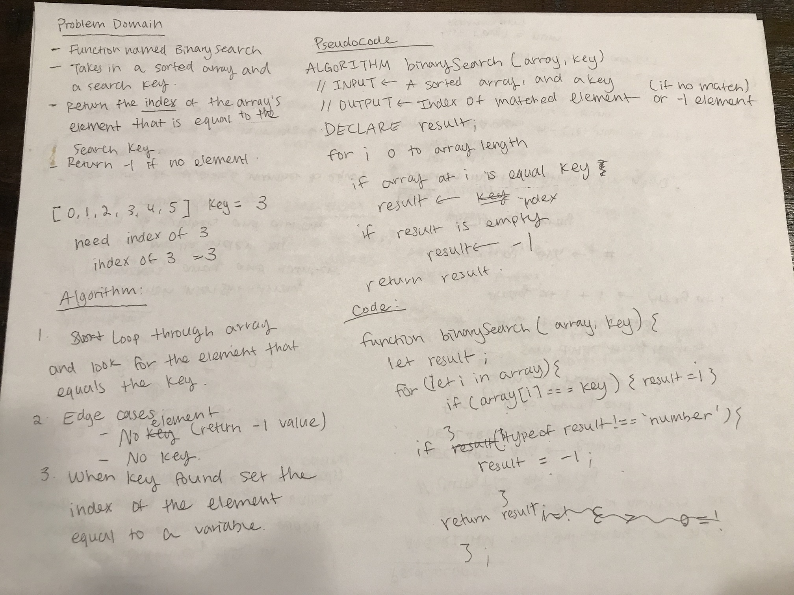

# 4. Linked List

Create link list that implements the folllowing:

- inserts nodes at the beginning of the list.
- checks to see if the list contains a value. (return true is exists, false if doesn't exist)
- prints values of the list.

# modules:

`node.js linked-list.js`

# 5. Linked List Insertions

Add to linked list module

## Challenge

Add to the linked list by creating methods called append (adds value to end of linked list), insertBefore(inserts value immediately before specified input value), and insertAfter (inserts value immediately after specified input value).

## Approach & Efficiency

Jag, Jesse, Melissa, Becky, and I all worked together on this challenge. We looped through the node list for all of the methods and stop at the right place to insert the node. We then redirect the pointers to point to the correct node which puts them in the right order.

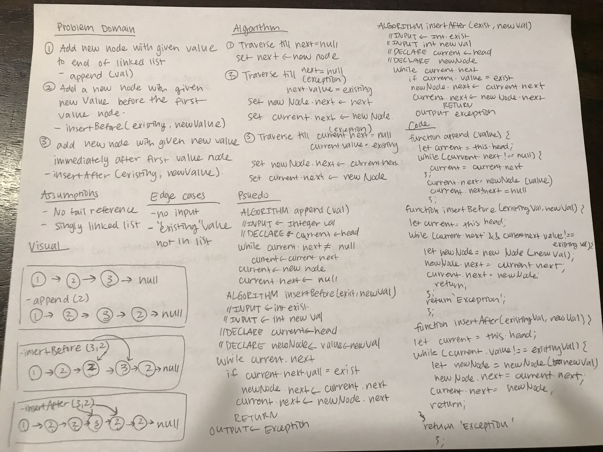

# 6. Linked List Insertion

Insert linked list kth from end

## Challenge

Write a method for the Linked List class which takes a number, k, as a parameter. Return the node’s value that is k from the end of the linked list. You have access to the Node class and all the properties on the Linked List class as well as the methods created in previous challenges.

## Approach & Efficiency

I set two pointers, the one that's faster sets when the slower one should start, according to the value of k. Then once the fast pointer reaches null, the slow pointer will reach k. Then return the value at the slow pointer.

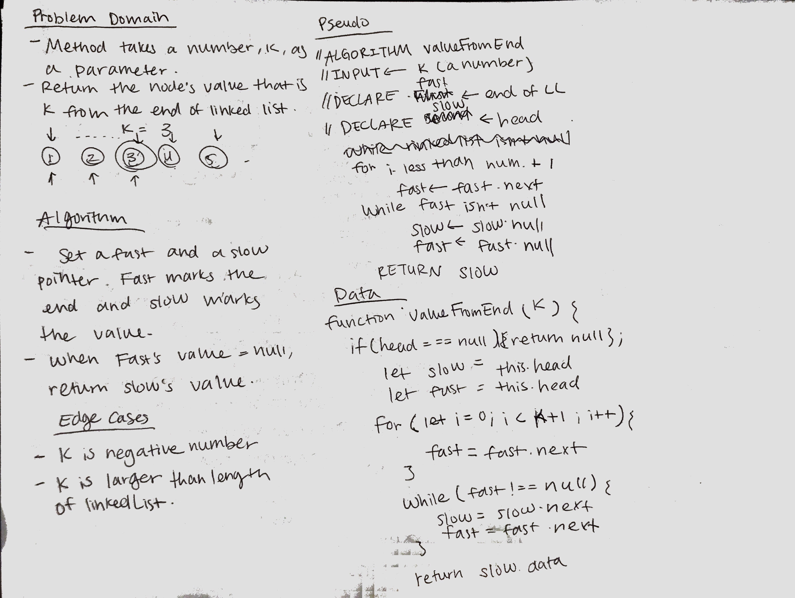

# 7. Merge Linked Lists

Merge two linked lists alternatively

## Challenge

Write a function called mergeLists which takes two linked lists as arguments. Zip the two linked lists together into one so that the nodes alternate between the two lists and return a reference to the head of the zipped list. Try and keep additional space down to O(1). You have access to the Node class and all the properties on the Linked List class as well as the methods created in previous challenges.

## Approach & Efficiency

First I declared list 1 and list 2's currents. Then declared list 1's next and list 2's next to keep track of the next after alternating. While list 1 and list 2 weren't null, I directed the pointers accordingly.

# 8. Stacks and Queues

Create stacks and queues algorithms

## Challenge

Create a class for stack and queue. Both should be able to add, delete, and peek, according to their functionality.

## Approach & Efficiency

For stack, I created a class with a constructor containing properties of storage, top, and length. For queue, I created a class with a constructor containing properties of storage, front, rear, and length. These methods were produced using TDD.

## API

### `stack.push`

Returns the length of the storage and adds value to the top of the stack.

### `stack.pop`

Returns the popped off value, removes item from stack and reduces the length of the storage.

### `stack.peek`

Returns and "peeks" at the value at the top of the stack

### `queue.enqueue`

Returns the length of the storage and adds value to the end of the queue.

### `queue.dequeue`

Returns the deleted value, removes value at the front of the queue.

### `queue.peek`

Returns and "peeks" at the value at the front of the queue.

# 11. stacks and queues

Merge two linked lists alternatively

## Challenge

Create a brand new PseudoQueue class. Do not use an existing Queue. Instead, this PseudoQueue class will implement our standard queue interface (the two methods listed below), but will internally only utilize 2 Stack objects. Ensure that you create your class with the following methods:

enqueue(value) which inserts value into the PseudoQueue, using a first-in, first-out approach.
dequeue() which extracts a value from the PseudoQueue, using a first-in, first-out approach.
The Stack instances have only push, pop, and peek methods. You should use your own Stack implementation. Instantiate these Stack objects in your PseudoQueue constructor.

## Approach & Efficiency

First I declared list 1 and list 2's currents. Then declared list 1's next and list 2's next to keep track of the next after alternating. While list 1 and list 2 weren't null, I directed the pointers accordingly.

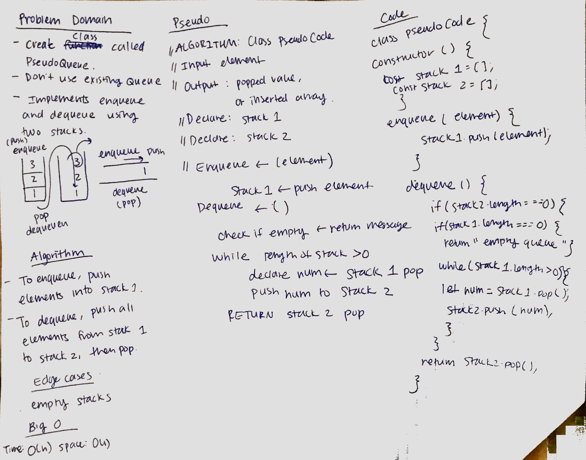

# 12. Animal Shelter

Create animal shelter class using queues

## Challenge

Create a class called AnimalShelter which holds only dogs and cats. The shelter operates using a first-in, first-out approach.
Implement the following methods:
enqueue(animal): adds animal to the shelter. animal can be either a dog or a cat object.
dequeue(pref): returns either a dog or a cat. If pref is not "dog" or "cat" then return null.

## Approach & Efficiency

I used two queues one for cats and one for dogs. To enqueue, I pushed according to the input value of cat or dog to their respective queques. To dequeue, I checked the input value then returned the correct queue's end object.

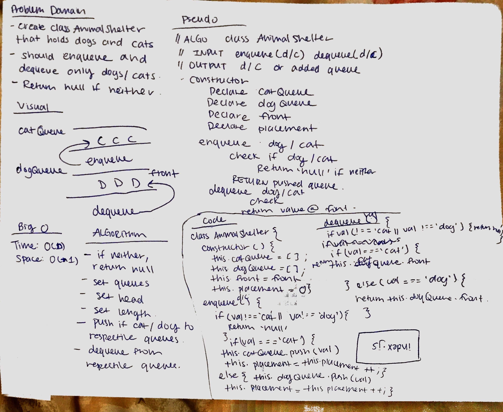

# 13. FizzBuzz Tree

Implement fizzbuzz on tree

## Challenge

Write a function called FizzBuzzTree which takes a tree as an argument.
Without utilizing any of the built-in methods available to your language, determine weather or not the value of each node is divisible by 3, 5 or both, and change the value of each of the nodes:
If the value is divisible by 3, replace the value with “Fizz”
If the value is divisible by 5, replace the value with “Buzz”
If the value is divisible by 3 and 5, replace the value with “FizzBuzz”
Return the tree with its new values.

## Approach & Efficiency

I traversed the tree with preorder and first checked if the value of the node is a number. I did this recursively by setting the base case to were the root's value equals null. Then I called the functions if the left and right values existed. While traversing, I can the fizzbuzz function and return the appropriate value of 'fizz', 'buzz', or 'fizzbuzz'.

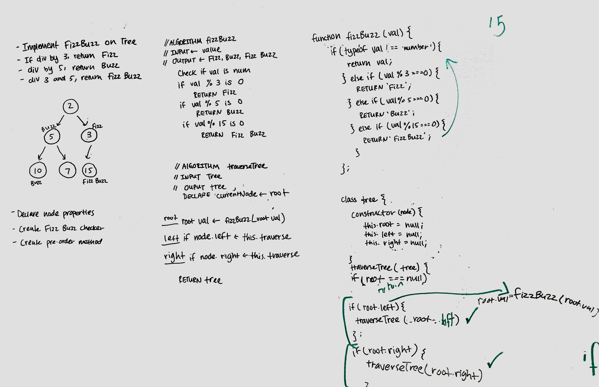

# 14. Depth of value

Find depth of given value in tree

## Challenge

Return the depth of a given node in a binary tree :) If the value doesn't exist, return null.

## Approach & Efficiency

Set base cases for when value doesn't exist/when value is not number and when the value equals root value. Traverse the tree with preorder and store the depth as a parameter. At the end of the function, return left or right to make sure both sides of the tree are being checked.

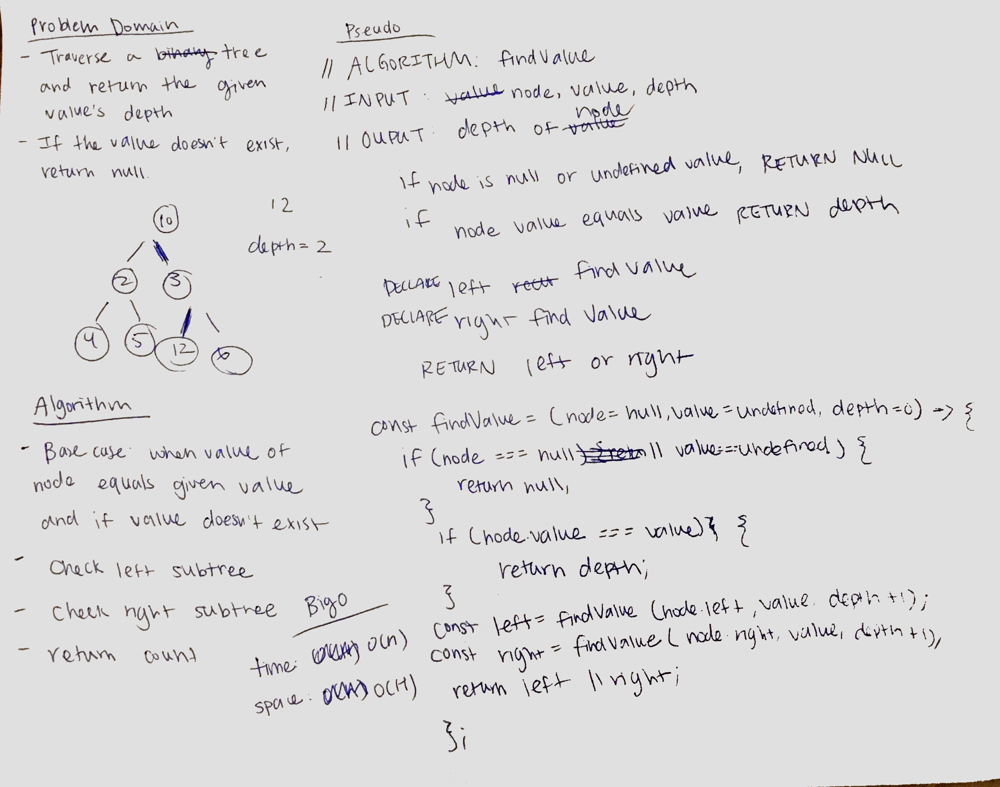

# 15. Greatest Value in tree

Find the greatest value in a binary tree

## Challenge

Write a function called find-maximum-value which takes binary tree as its only input. Without utilizing any of the built-in methods available to your language, return the maximum value stored in the tree. You can assume that the values stored in the Binary Tree will be numeric.

## Approach & Efficiency

Using breadth first traversal, I enqueue the root of the tree and traverse while enqueing and dequeuing. I set a while loop and set the condition to where the length of the queue must be greater than 0. Set the root of the tree to the dequeued value and check if the left and the right of the tree exist. If they do, enqueue and repeat the process. In the end, return the greatest value.

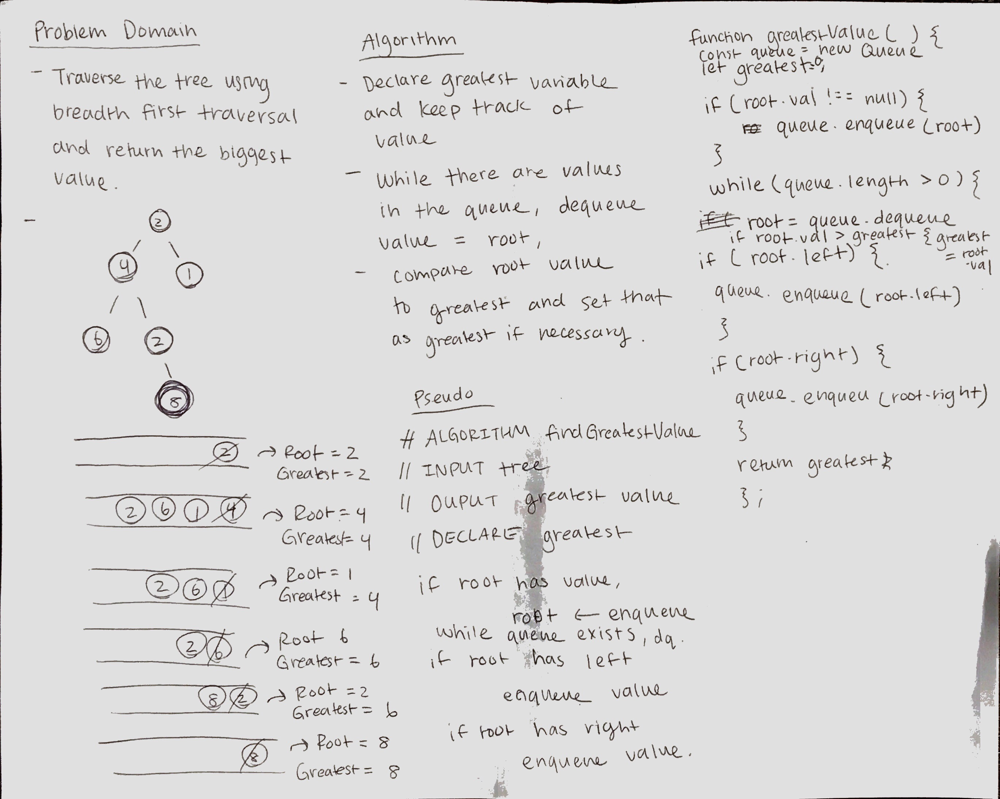

# 16. Reverse Array

Reverse an array in three different ways

## Challenge

Reverse an array in three different ways

## Approach & Efficiency

I used recursion, reduce, for loop/ push to new array, and the reverse method.

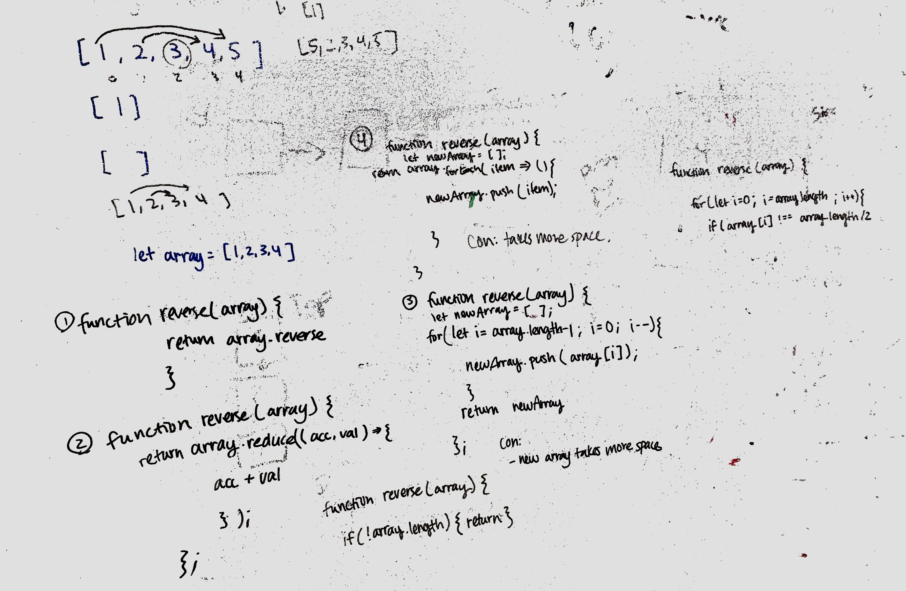

# 17. Second Largest Value

Find the second largest value

## Challenge

Find the second largest value in a given array in three different ways.

## Approach & Efficiency

Method one: Use a set to remove duplicate arrays then turn it into an array, find the largest value in the array and delete it, then find the max value in the nex array. Con: this method takes more space since it is using a set, and an array, altering the array.

Method two: Sort the values from least to greatest and return the second to last value. Pro: Quick and clean code. Con: Sorting takes longer since it is altering the array each time.

Method three: Delcare two variables, a biggest and a nextBiggest. Loop through the array and if the value is greater than biggest, set the value to biggest and set biggest to next biggest. Else if the value doesn't equal the biggest and it is greater than next biggest, set the value to next biggest. Pro: this is the most efficient way with time of O(n) and space of O(1).

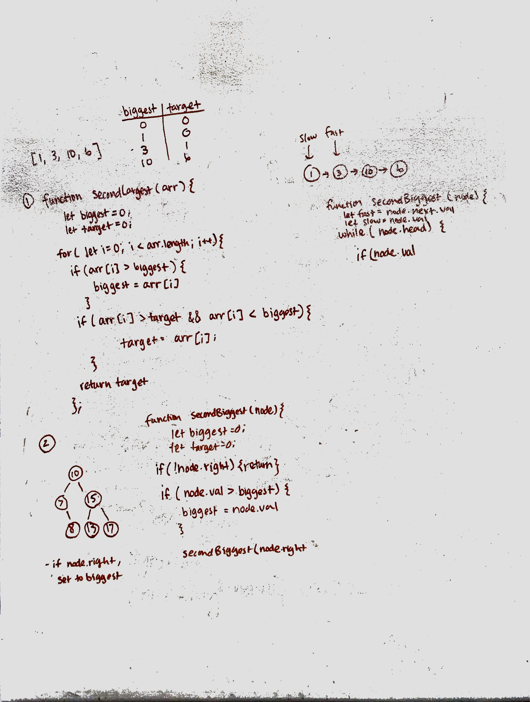

# 18. Two Values Sum

Find two values that sum to given value

## Challenge

Given an array and a value, return an array of two values that result in the sum of the given value.

## Approach & Efficiency

Method one: Declared sumOne and sumTwo variables to keep track of sums. Used a nested for loop to check each index against the rest of the array to see if the sum of the index and the rest of the index equal the given value. Pro: Does not take up much space, Con: the time is O(n) squared because of the nested loop.

Method two: Use a loop and at each index, check the difference between the value of the index and the given value. If the array includes the difference value, return that value and the value at the index being looped through as an array. Pro: Does not take up space and faster fun time.

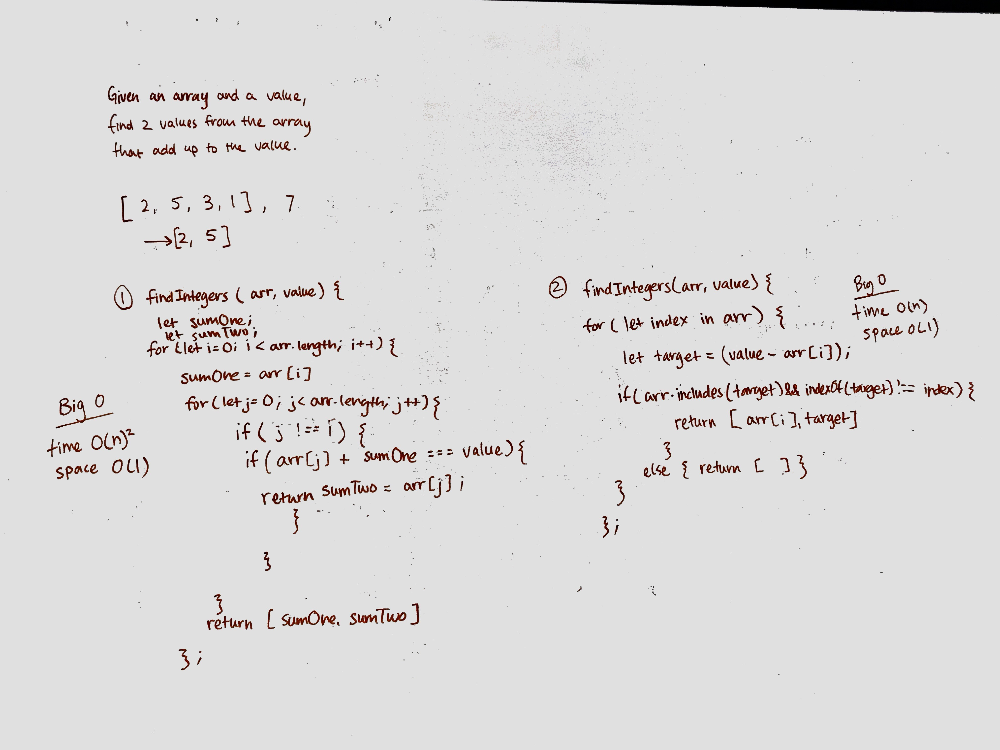

# Hashtables

Hashtables are a data structure that utilize key value pairs. This means every Node or Bucket has both a key, and a value.

The basic idea of a hashtable is the ability to store the key into this data structure, and quickly retrieve the value. This is done through what we call a hash. A hash is the ability to encode the key that will eventually map to a specific location in the data structure that we can look at directly to retrieve the value.

Since we are able to hash our key and determine the exact location where our value is stored, we can do a lookup in an O(1) time complexity. This is ideal when quick lookups are required.

## Challenge

Implement a Hashtable with the following methods:

add: takes in both the key and value. This method should hash the key, and add the key and value pair to the table, handling collisions as needed.
get: takes in the key and returns the value from the table.
contains: takes in the key and returns a boolean, indicating if the key exists in the table already.
hash: takes in an arbitrary key and returns an index in the collection.

## Approach & Efficiency

I set up the hashtable to store an array of objects starting with a length of 100. First it checks if the given key is a string and converts it into the sum of the ascii code of each letter. Then it multiplies the value by 599 and returns the modulus of 100 (length of data) as the index.

## API

`hash(key)` -> takes in value and returns an index
`get(key)` -> gets the value at the given key
`contains(key)` -> returns boolean based of whether or not key exists
`add(key,value)` -> adds key value pair to table
