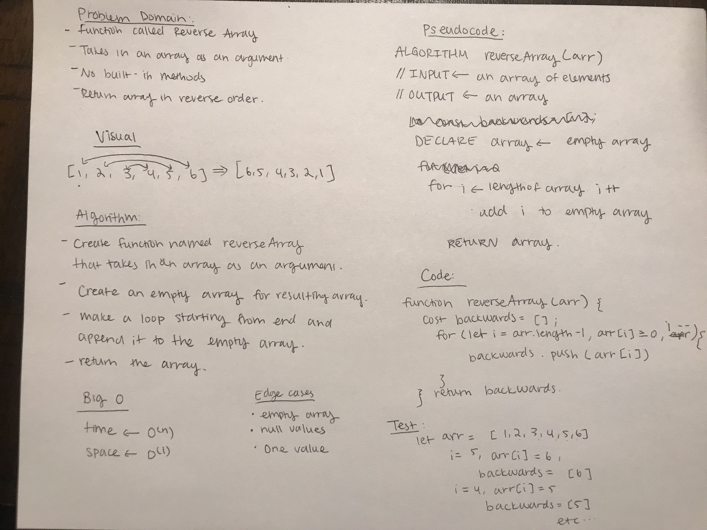
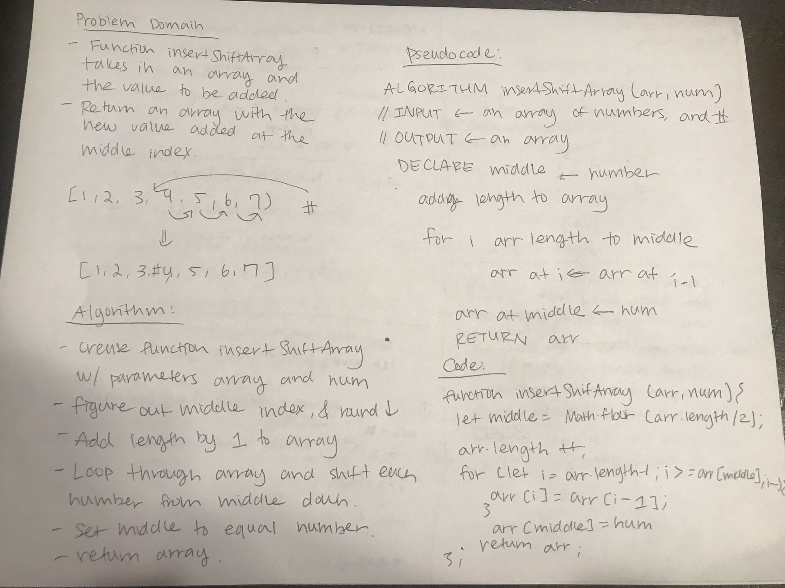

# data-structures-and-algorithms-401

# 1. Reverse an Array

Produce an array in reverse order.

## Challenge

Write a function called `reverseArray` which takes an array as an argument. Return an array in reverse order without using any built-in methods available to your language.

## Approach & Efficiency

I used a for loop starting from the end of the array and appending each item to an empty array, decreasing the position of i each time.

## Solution

# 2. Insert Shift Array

Insert number and shift array.

## Challenge

Write a function called insertShiftArray which takes in an array and the value to be added. Without utilizing any of the built-in methods available to your language, return an array with the new value added at the middle index.

## Approach & Efficiency

For this challenge, I defined the middle index, increased the length of the array by 1, shifted the values after the middle index one over, then added the input number as the middle index.

## Solution

