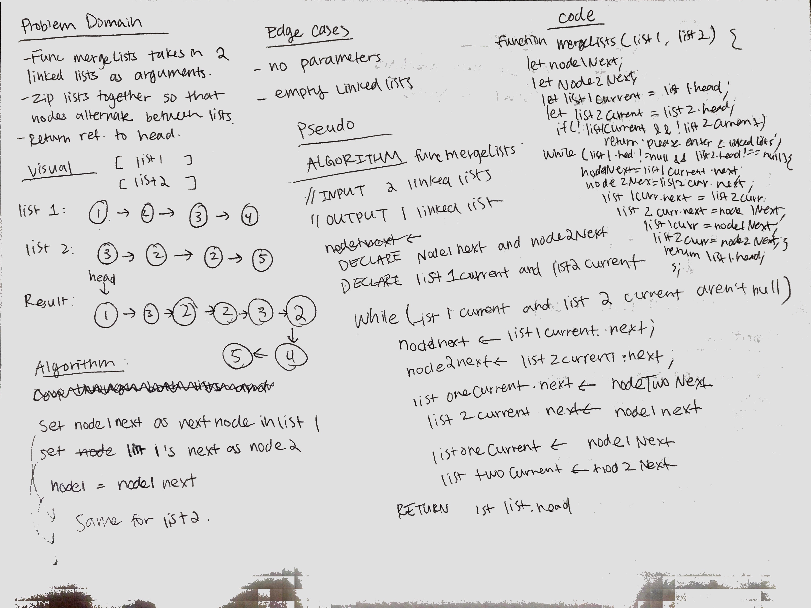

# data-structures-and-algorithms-401

# 1. Reverse an Array

Produce an array in reverse order.

## Challenge

Write a function called `reverseArray` which takes an array as an argument. Return an array in reverse order without using any built-in methods available to your language.

## Approach & Efficiency

I used a for loop starting from the end of the array and appending each item to an empty array, decreasing the position of i each time.

## Solution

---

# 2. Insert Shift Array

Insert number and shift array.

## Challenge

Write a function called insertShiftArray which takes in an array and the value to be added. Without utilizing any of the built-in methods available to your language, return an array with the new value added at the middle index.

## Approach & Efficiency

For this challenge, I defined the middle index, increased the length of the array by 1, shifted the values after the middle index one over, then added the input number as the middle index.

## Solution

---

# 3. Binary Search

Look for matching element in array.

## Challenge

Write a function called BinarySearch which takes in 2 parameters: a sorted array and the search key. Without utilizing any of the built-in methods available to your language, return the index of the array’s element that is equal to the search key, or -1 if the element does not exist.

## Approach & Efficiency

I looped through the array and saw if each of the elements matched the key. If there was a match, the result previously declared is set equal to the element's index. If there were no matches, the result is set to -1.

## Solution

# 4. Linked List

Create link list that implements the folllowing:

- inserts nodes at the beginning of the list.
- checks to see if the list contains a value. (return true is exists, false if doesn't exist)
- prints values of the list.

# modules:

`node.js linked-list.js`

# 5. Linked List Insertions

Add to linked list module

## Challenge

Add to the linked list by creating methods called append (adds value to end of linked list), insertBefore(inserts value immediately before specified input value), and insertAfter (inserts value immediately after specified input value).

## Approach & Efficiency

Jag, Jesse, Melissa, Becky, and I all worked together on this challenge. We looped through the node list for all of the methods and stop at the right place to insert the node. We then redirect the pointers to point to the correct node which puts them in the right order.

# 6. Linked List Insertion

Insert linked list kth from end

## Challenge

Write a method for the Linked List class which takes a number, k, as a parameter. Return the node’s value that is k from the end of the linked list. You have access to the Node class and all the properties on the Linked List class as well as the methods created in previous challenges.

## Approach & Efficiency

I set two pointers, the one that's faster sets when the slower one should start, according to the value of k. Then once the fast pointer reaches null, the slow pointer will reach k. Then return the value at the slow pointer.

# 7. Merge Linked Lists

Merge two linked lists alternatively

## Challenge

Write a function called mergeLists which takes two linked lists as arguments. Zip the two linked lists together into one so that the nodes alternate between the two lists and return a reference to the head of the zipped list. Try and keep additional space down to O(1). You have access to the Node class and all the properties on the Linked List class as well as the methods created in previous challenges.

## Approach & Efficiency

First I declared list 1 and list 2's currents. Then declared list 1's next and list 2's next to keep track of the next after alternating. While list 1 and list 2 weren't null, I directed the pointers accordingly.

# 8. Stacks and Queues

Create stacks and queues algorithms

## Challenge

Create a class for stack and queue. Both should be able to add, delete, and peek, according to their functionality.

## Approach & Efficiency

For stack, I created a class with a constructor containing properties of storage, top, and length. For queue, I created a class with a constructor containing properties of storage, front, rear, and length. These methods were produced using TDD.

## API

### `stack.push`

Returns the length of the storage and adds value to the top of the stack.

### `stack.pop`

Returns the popped off value, removes item from stack and reduces the length of the storage.

### `stack.peek`

Returns and "peeks" at the value at the top of the stack

### `queue.enqueue`

Returns the length of the storage and adds value to the end of the queue.

### `queue.dequeue`

Returns the deleted value, removes value at the front of the queue.

### `queue.peek`

Returns and "peeks" at the value at the front of the queue.
